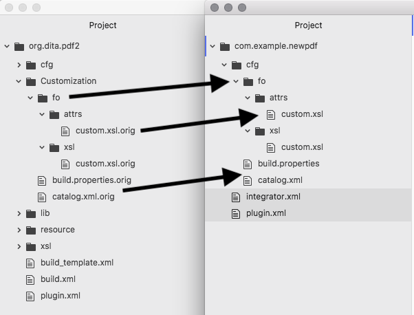
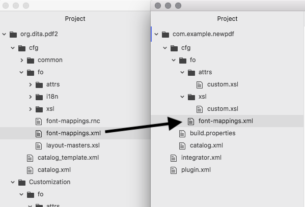
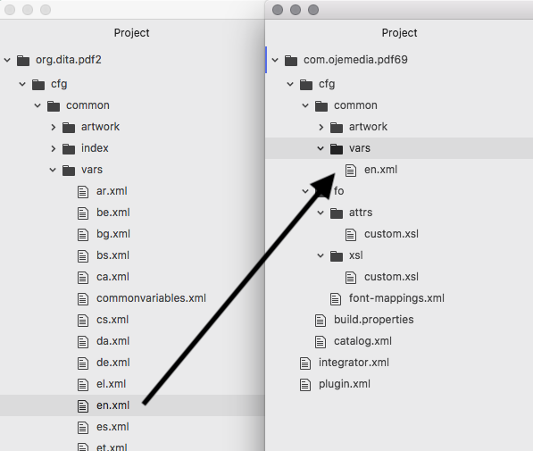

# Creating a Simple PDF Plugin

In this task, we will start with a very simple PDF plugin.

The primary modifications are:

* page size: 6in by 9in, with no side column and some simple margin changes
* no mini-TOC at the beginning of each chapter
* PDF bookmarks are expanded by default

The default plugin has a basic framework in its Customization directory,
ready for you to copy and modify as needed.

1. Create a new directory, `com.example.newpdf`.
2. Copy the `org.dita.pdf2/Customization` directory into your plugin directory and rename it `cfg`.
   Remove the `.orig` extension from the files in the copied directory. It should look like this:

    
3. Copy the file `org.dita.pdf2/cfg/fo/font-mappings.xml` to `com.example.newpdf/cfg/fo/`:

    
4. Create the directory `com.example.newpdf/cfg/common/vars`.
5. Copy the file `org.dita.pdf2/cfg/common/vars/en.xml` to the directory you just created:

    
6. Create `plugin.xml` at the top of your plugin directory and set it up:
    ```language-markup
    <?xml version='1.0' encoding='UTF-8'?>
    <plugin id="com.example.newpdf">
      <require plugin="org.dita.pdf2"/>
      <feature extension="dita.conductor.transtype.check" value="newpdf"/>
      <feature extension="dita.transtype.print" value="newpdf"/>
      <feature extension="dita.conductor.target.relative"
        file="integrator.xml"/>
    </plugin>
    ```
    * The `require` line tells DITA-OT to use its default PDF plugin
      for any logic not defined in this plugin.
    * The first two `feature` lines define the *transtype*,
      the unique name used to invoke the plugin. In this example, we call it `newpdf`.
    * The third `feature` line tells DITA-OT to look for additional information
      in the file `integrator.xml` (defined in the next step).
7. Create `integrator.xml` at the top of your plugin directory and set it up:
    ```language-markup
    <?xml version='1.0' encoding='UTF-8'?>
    <project name="com.example.newpdf">
      <target name="dita2newpdf.init">
        <property name="customization.dir"
           location="${dita.plugin.com.example.newpdf.dir}/cfg"/>
        <property file="${customization.dir}/build.properties"/>
      </target>

      <target name="dita2newpdf" depends="dita2newpdf.init, dita2pdf2"/>
    </project>
    ```
    * The project name should match the plugin ID defined in `build.xml`.
    * The first `property` line tells DITA-OT where to find our customizations.
    * The second `property` line tells DITA-OT where to find property settings.
8. Edit `com.example.newpdf/cfg/build.properties`:
    ```
    image.info.task=disabled
    args.bookmark.style=EXPANDED
    args.chapter.layout=BASIC
    ```
    This file defines property settings you always want for this plugin.
9. Edit `com.example.newpdf/cfg/fo/attrs/custom.xsl`:
    ```language-markup
    <?xml version='1.0'?>
    <xsl:stylesheet xmlns:xsl="http://www.w3.org/1999/XSL/Transform"
        xmlns:fo="http://www.w3.org/1999/XSL/Format" version="2.0">

        <!-- page layout (basic-settings.xsl) -->
        <xsl:variable name="page-width">6in</xsl:variable>
        <xsl:variable name="page-height">9in</xsl:variable>

        <xsl:variable name="page-margin-inside">0.75in</xsl:variable>
        <xsl:variable name="page-margin-outside">0.5in</xsl:variable>
        <xsl:variable name="page-margin-top">0.75in</xsl:variable>
        <xsl:variable name="page-margin-bottom">0.5in</xsl:variable>
        <xsl:variable name="mirror-page-margins" select="true()"/>
        <xsl:variable name="side-col-width">0pt</xsl:variable>

        <xsl:variable name="default-font-size">11pt</xsl:variable>
        <xsl:variable name="default-line-height">13pt</xsl:variable>
    </xsl:stylesheet>
    ```
10.  Copy the plugin directory to `plugins` in your DITA-OT directory,
     then run `dita --install` to set it up.

Now, formatting with `--output=newpdf` gives you a PDF in a smaller page size.

Before you continue, examine `cfg/common/vars/en.xml` and change strings to your liking.
Note that there is no chapter number in the headers; the next task shows how to add them.

Finally, examine `cfg/fo/font-mappings.xml` and change fonts if you want.
The preferred font comes first, followed by alternative fonts
(which may be used if the preferred font exists, but is missing a needed character).
